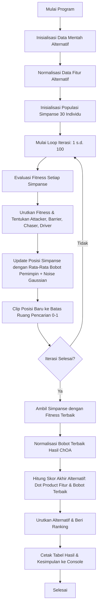

# Sistem Pendukung Keputusan Pemilihan Paket Internet Menggunakan Chimp Optimization Algorithm (ChOA)

Proyek ini mengimplementasikan Sistem Pendukung Keputusan (SPK) berbasis pemrograman Python untuk menentukan paket internet terbaik dari berbagai provider seluler di Indonesia. Penentuan keputusan dilakukan dengan menggunakan pendekatan optimasi bobot kriteria melalui metaheuristik **Chimp Optimization Algorithm (ChOA)**.

---

## Disusun Oleh
* **Irfan Syarifudin** (NIM: 24.83.1127)
* **Sufutra Jaya Inathasalen** (NIM: 24.83.1147)

---

## Daftar Isi
1. [Pendahuluan](#1-pendahuluan)
2. [Dataset dan Parameter Kriteria](#2-dataset-dan-parameter-kriteria)
3. [Proses Normalisasi Data (Preprocessing)](#3-proses-normalisasi-data-preprocessing)
4. [Algoritma Optimasi Chimp (ChOA)](#4-algoritma-optimasi-chimp-choa)
5. [Formulasi Matematis & Fungsi Fitness](#5-formulasi-matematis--fungsi-fitness)
6. [Alur Kerja Sistem (Workflow)](#6-alur-kerja-sistem-workflow)
7. [Struktur Kode Sumber](#7-struktur-kode-sumber)
8. [Persyaratan Sistem & Cara Instalasi](#8-persyaratan-sistem--cara-instalasi)
9. [Hasil Eksekusi Program](#9-hasil-eksekusi-program)
10. [Analisis & Kesimpulan](#10-analisis--kesimpulan)

---

## 1. Pendahuluan
Dalam era digital, pemilihan paket internet sering kali membingungkan konsumen karena adanya trade-off antar kriteria (misalnya, harga murah biasanya menawarkan kuota kecil atau kualitas jaringan yang kurang optimal). Untuk memecahkan masalah ini, proyek ini menggunakan metode **Sistem Pendukung Keputusan (SPK)**. 

Alih-alih menentukan bobot kriteria secara subjektif atau manual, sistem ini memanfaatkan **Chimp Optimization Algorithm (ChOA)** untuk mengoptimalkan bobot preferensi kriteria agar mendekati target preferensi ideal secara objektif. Skor akhir dari masing-masing alternatif paket dihitung menggunakan metode penjumlahan terbobot (*Simple Additive Weighting* / *Weighted Product* concept) untuk menghasilkan perankingan paket internet terbaik.

---

## 2. Dataset dan Parameter Kriteria

Sistem mengevaluasi **12 alternatif paket internet** dari 6 provider berbeda (Telkomsel, Tri, by.U, Indosat IM3, XL, dan Smartfren) berdasarkan **5 kriteria utama**:

1. **Harga (Cost):** Biaya paket dalam Rupiah (Rp). Diinginkan nilai sekecil mungkin.
2. **Kuota (Benefit):** Besarnya volume data dalam Gigabyte (GB). Diinginkan nilai sebesar mungkin.
3. **Masa Aktif (Benefit):** Durasi aktif paket dalam hari. Diinginkan nilai sebesar mungkin.
4. **Jaringan (Benefit):** Skala kualitas sinyal/jaringan (skala 1 - 10). Diinginkan nilai sebesar mungkin.
5. **Bonus (Benefit):** Ketersediaan bonus kuota/layanan tambahan (skala 1 - 10). Diinginkan nilai sebesar mungkin.

### Data Mentah Alternatif
| Provider | Nama Paket | Harga (Rp) | Kuota (GB) | Masa Aktif (Hari) | Jaringan (1-10) | Bonus (1-10) |
|---|---|---|---|---|---|---|
| Telkomsel | Super Seru 25 GB | 60.000 | 25 | 28 | 9 | 7 |
| Telkomsel | Super Seru 40 GB | 80.000 | 40 | 28 | 9 | 7 |
| Tri | Happy 30 GB | 70.000 | 30 | 30 | 7 | 6 |
| Tri | AlwaysOn 40 GB | 85.000 | 40 | 30 | 7 | 7 |
| by.U | Yang Bikin Nagih | 50.499 | 12 | 30 | 8 | 5 |
| by.U | Yang Dicap Dua Jempol | 121.199 | 50 | 30 | 8 | 6 |
| Indosat IM3 | Freedom Internet 20 GB | 65.000 | 20 | 30 | 8 | 6 |
| Indosat IM3 | Freedom Internet 40 GB | 100.000 | 40 | 30 | 8 | 7 |
| XL | Xtra Combo Flex M | 53.000 | 10 | 28 | 8 | 6 |
| XL | Xtra Combo Flex M+ | 64.000 | 14 | 28 | 8 | 6 |
| Smartfren | Unlimited Nonstop 12 GB | 56.500 | 12 | 30 | 7 | 8 |
| Smartfren | Unlimited Nonstop 30 GB | 79.500 | 30 | 30 | 7 | 8 |

---

## 3. Proses Normalisasi Data (Preprocessing)

Untuk menghilangkan perbedaan satuan dan skala antar kriteria, dilakukan normalisasi ke dalam rentang $[0, 1]$ dengan rumus matematis sebagai berikut:

### a. Kriteria Harga (Cost - Minimisasi)
Menggunakan rumus min-max invers agar nilai harga terendah mendapatkan skor normalisasi mendekati $1$, sedangkan harga tertinggi mendekati $0$:
$$\text{Harga}_{N, i} = 1 - \frac{\text{Harga}_i - \text{Harga}_{\min}}{\text{Harga}_{\max} - \text{Harga}_{\min}}$$

### b. Kriteria Kuota (Benefit - Maksimisasi)
Menggunakan rumus min-max standar:
$$\text{Kuota}_{N, i} = \frac{\text{Kuota}_i - \text{Kuota}_{\min}}{\text{Kuota}_{\max} - \text{Kuota}_{\min}}$$

### c. Kriteria Masa Aktif (Benefit)
Normalisasi disesuaikan dengan nilai referensi batas atas (30 hari):
$$\text{MasaAktif}_{N, i} = \min\left(\frac{\text{MasaAktif}_i}{30}, 1.0\right)$$

### d. Kriteria Jaringan dan Bonus (Benefit)
Karena menggunakan rating skala 1 hingga 10, normalisasi dilakukan dengan pembagian skala maksimum:
$$\text{Jaringan}_{N, i} = \frac{\text{Jaringan}_i}{10}$$
$$\text{Bonus}_{N, i} = \frac{\text{Bonus}_i}{10}$$


---

## 4. Algoritma Optimasi Chimp (ChOA)

**Chimp Optimization Algorithm (ChOA)** adalah algoritma metaheuristik berbasis kecerdasan kelompok (*swarm intelligence*) yang diinspirasi oleh perilaku sosial dan berburu simpanse. Dalam skenario perburuan alami, koloni simpanse membagi tugasnya ke dalam 4 peran kepemimpinan utama untuk mengepung mangsa:

1. **Attacker (Penyerang):** Mengarahkan serangan langsung ke mangsa. Diwakili oleh individu dengan *fitness* terbaik ke-1.
2. **Barrier (Penghalang):** Memposisikan diri untuk menghalangi rute pelarian mangsa. Diwakili oleh individu terbaik ke-2.
3. **Chaser (Pengejar):** Mengejar mangsa secara agresif. Diwakili oleh individu terbaik ke-3.
4. **Driver (Penggiring):** Menggiring mangsa ke arah penyerang. Diwakili oleh individu terbaik ke-4.

### Pembaruan Posisi (Matematika Algoritma)
Dalam implementasi program ini, pergerakan simpanse didorong oleh kombinasi acak dari keempat kepemimpinan tersebut:

$$X_{baru} = \frac{r_1 \cdot X_{Attacker} + r_2 \cdot X_{Barrier} + r_3 \cdot X_{Chaser} + r_4 \cdot X_{Driver}}{r_1 + r_2 + r_3 + r_4}$$

Di mana:
* $r_1, r_2, r_3, r_4 \sim U(0, 1)$ adalah angka acak uniform yang menentukan kontribusi relatif dari masing-masing pemimpin.
* $X_{Attacker}, X_{Barrier}, X_{Chaser}, X_{Driver}$ adalah vektor posisi dari 4 simpanse terbaik pada iterasi saat ini.

Untuk meningkatkan kemampuan eksplorasi global (*diversification*) dan menghindari jebakan optimum lokal (*local optima trapping*), ditambahkan perturbasi acak berbasis distribusi Gaussian:
$$X_{baru} \leftarrow X_{baru} + \mathcal{N}(0, 0.02^2)$$

Terakhir, vektor posisi baru dilakukan pemangkasan batas (*clipping*) agar tetap berada dalam ruang pencarian valid:
$$X_{baru} \leftarrow \text{clip}(X_{baru}, 0, 1)$$

---

## 5. Formulasi Matematis & Fungsi Fitness

Algoritma ChOA ditugaskan mencari vektor bobot $W = [w_{\text{harga}}, w_{\text{kuota}}, w_{\text{masa aktif}}, w_{\text{jaringan}}, w_{\text{bonus}}]$ yang meminimalkan simpangan terhadap profil bobot preferensi target ideal:
$$W_{\text{target}} = [0.18, 0.25, 0.12, 0.35, 0.10]$$


### a. Normalisasi Bobot L1 (Pembatas)
Setiap koordinat posisi simpanse yang bernilai acak dikonversi menjadi bobot valid melalui normalisasi mutlak (sehingga total bobot selalu bernilai $1.0$):
$$w_i = \frac{|x_i|}{\sum_{j=1}^{5} |x_j|}$$

### b. Perhitungan Nilai Kesalahan (Mean Squared Error - MSE)
$$MSE(W) = \frac{1}{D} \sum_{i=1}^{D} (w_i - W_{\text{target}, i})^2$$
Di mana $D = 5$ (dimensi kriteria).

### c. Fungsi Fitness
Fungsi fitness didesain berbanding terbalik dengan nilai *error* (MSE). Target optimasi adalah memaksimalkan nilai ini:
$$\text{Fitness}(W) = \frac{1}{1 + MSE(W)}$$
* Nilai fitness maksimal adalah $1.0$ (tercapai jika MSE bernilai $0$, yang berarti kecocokan bobot 100% sempurna dengan target).


---

## 6. Alur Kerja Sistem (Workflow)



---

## 7. Struktur Kode Sumber

Implementasi algoritma ini diatur dalam satu berkas terstruktur `main.py` dengan pembagian fungsi sebagai berikut:

* **Inisialisasi Data & Normalisasi (Baris 8 - 36):** Mendefinisikan dataset dalam `pandas.DataFrame` dan melakukan transformasi matematis min-max untuk setiap fitur.
* **Fungsi `normalize_weights(weights)` (Baris 39 - 47):** Memastikan semua bobot kandidat bernilai positif dan berjumlah total tepat $1.0$.
* **Fungsi `fitness(weights)` (Baris 48 - 53):** Menghitung nilai kebugaran (fitness) berdasarkan kedekatan dengan target bobot menggunakan metrik MSE.
* **Proses Optimasi ChOA (Baris 55 - 86):** Bagian inti algoritma optimasi yang mengontrol populasi sebanyak 30 simpanse selama 100 iterasi.
* **Evaluasi & Perankingan (Baris 88 - 96):** Melakukan perkalian matriks (*dot product*) nilai normalisasi alternatif dengan bobot hasil optimasi untuk mendapatkan skor akhir.
* **Fungsi Visualisasi `print_table(headers, data)` (Baris 98 - 115):** Mengatur formatting cetak tabel dinamis pada terminal agar rapi dan mudah dibaca tanpa library eksternal tambahan.

---

## 8. Persyaratan Sistem & Cara Instalasi

### Persyaratan Minimum
* Python 3.7 ke atas
* Library NumPy
* Library Pandas

### Langkah Instalasi

1. **Clone repository ini** atau unduh berkas kode:
   ```bash
   git clone https://github.com/Irfan3006/Chimp-Optimization-Algorithm-ChOA-.git
   cd Chimp-Optimization-Algorithm-ChOA-
   ```

2. **Instal dependensi** menggunakan pip:
   ```bash
   pip install numpy pandas
   ```

3. **Jalankan program utama**:
   ```bash
   python main.py
   ```

---

## 9. Hasil Eksekusi Program

Berikut adalah cuplikan hasil keluaran nyata (*actual output*) setelah program dijalankan pada console terminal:

```text
+------------------------------------------------------------------------+
|        SISTEM PEMILIHAN PAKET INTERNET TERBAIK MENGGUNAKAN ChOA        |
+------------------------------------------------------------------------+

[ Bobot Terbaik Hasil Optimasi ChOA ]
  - Harga       : 0.179 (17.9%)
  - Kuota       : 0.249 (24.9%)
  - Masa Aktif  : 0.119 (11.9%)
  - Jaringan    : 0.350 (35.0%)
  - Bonus       : 0.103 (10.3%)

[ Tabel Nilai Normalisasi ]
+-------------+-------------------------+---------+---------+-------------+------------+---------+
| Provider    | Nama Paket              | Harga_N | Kuota_N | MasaAktif_N | Jaringan_N | Bonus_N |
+-------------+-------------------------+---------+---------+-------------+------------+---------+
| Telkomsel   | Super Seru 25 GB        | 0.866   | 0.375   | 0.933       | 0.900      | 0.700   |
| Telkomsel   | Super Seru 40 GB        | 0.583   | 0.750   | 0.933       | 0.900      | 0.700   |
| Tri         | Happy 30 GB             | 0.724   | 0.500   | 1.000       | 0.700      | 0.600   |
| Tri         | AlwaysOn 40 GB          | 0.512   | 0.750   | 1.000       | 0.700      | 0.700   |
| by.U        | Yang Bikin Nagih        | 1.000   | 0.050   | 1.000       | 0.800      | 0.500   |
| by.U        | Yang Dicap Dua Jempol   | 0.000   | 1.000   | 1.000       | 0.800      | 0.600   |
| Indosat IM3 | Freedom Internet 20 GB  | 0.795   | 0.250   | 1.000       | 0.800      | 0.600   |
| Indosat IM3 | Freedom Internet 40 GB  | 0.300   | 0.750   | 1.000       | 0.800      | 0.700   |
| XL          | Xtra Combo Flex M       | 0.965   | 0.000   | 0.933       | 0.800      | 0.600   |
| XL          | Xtra Combo Flex M+      | 0.809   | 0.100   | 0.933       | 0.800      | 0.600   |
| Smartfren   | Unlimited Nonstop 12 GB | 0.915   | 0.050   | 1.000       | 0.700      | 0.800   |
| Smartfren   | Unlimited Nonstop 30 GB | 0.590   | 0.500   | 1.000       | 0.700      | 0.800   |
+-------------+-------------------------+---------+---------+-------------+------------+---------+

[ Ranking Paket Internet Terbaik ]
+---------+-------------+-------------------------+-----------+-------+------------+----------+-------+------------+
| Ranking | Provider    | Nama Paket              | Harga     | Kuota | Masa Aktif | Jaringan | Bonus | Skor Akhir |
+---------+-------------+-------------------------+-----------+-------+------------+----------+-------+------------+
| 1       | Telkomsel   | Super Seru 40 GB        | Rp80,000  | 40    | 28         | 9        | 7     | 0.789      |
| 2       | Telkomsel   | Super Seru 25 GB        | Rp60,000  | 25    | 28         | 9        | 7     | 0.747      |
| 3       | Tri         | AlwaysOn 40 GB          | Rp85,000  | 40    | 30         | 7        | 7     | 0.715      |
| 4       | Indosat IM3 | Freedom Internet 40 GB  | Rp100,000 | 40    | 30         | 8        | 7     | 0.712      |
| 5       | by.U        | Yang Dicap Dua Jempol   | Rp121,199 | 50    | 30         | 8        | 6     | 0.710      |
| 6       | Tri         | Happy 30 GB             | Rp70,000  | 30    | 30         | 7        | 6     | 0.680      |
| 7       | Smartfren   | Unlimited Nonstop 30 GB | Rp79,500  | 30    | 30         | 7        | 8     | 0.677      |
| 8       | Indosat IM3 | Freedom Internet 20 GB  | Rp65,000  | 20    | 30         | 8        | 6     | 0.666      |
| 9       | by.U        | Yang Bikin Nagih        | Rp50,499  | 12    | 30         | 8        | 5     | 0.642      |
| 10      | XL          | Xtra Combo Flex M       | Rp53,000  | 10    | 28         | 8        | 6     | 0.626      |
+---------+-------------+-------------------------+-----------+-------+------------+----------+-------+------------+

==========================================================================
 KESIMPULAN
==========================================================================
 Paket terbaik adalah Telkomsel - Super Seru 40 GB
 dengan skor akhir 0.789.
==========================================================================
```

---

## 10. Analisis & Kesimpulan

1. **Hasil Optimasi Bobot:**
   Hasil dari ChOA menunjukkan konvergensi bobot yang sangat mendekati target preferensi:
   * **Harga:** $17.9\%$ (Target $18\%$)
   * **Kuota:** $24.9\%$ (Target $25\%$)
   * **Masa Aktif:** $11.9\%$ (Target $12\%$)
   * **Jaringan:** $35.0\%$ (Target $35\%$)
   * **Bonus:** $10.3\%$ (Target $10\%$)
   
   Hal ini membuktikan bahwa algoritma ChOA bekerja secara akurat dalam meminimalkan simpangan (*error*) populasi hingga mencapai kondisi optimum global.

2. **Rekomendasi Terbaik:**
   Paket **Telkomsel - Super Seru 40 GB** terpilih sebagai alternatif terbaik dengan skor akhir tertinggi sebesar **0.789**. 
   * **Mengapa terpilih?** Paket ini memiliki skor normalisasi **Jaringan_N** sebesar `0.900` (sangat tinggi) dan **Kuota_N** sebesar `0.750`. Mengingat kriteria Jaringan memiliki bobot terbesar ($35.0\%$) disusul Kuota ($24.9\%$), keunggulan Telkomsel di dua kriteria utama tersebut memberikan dorongan nilai utilitas akhir yang signifikan, mengalahkan paket yang lebih murah namun berkualitas sinyal lebih rendah atau kuota lebih sedikit.
